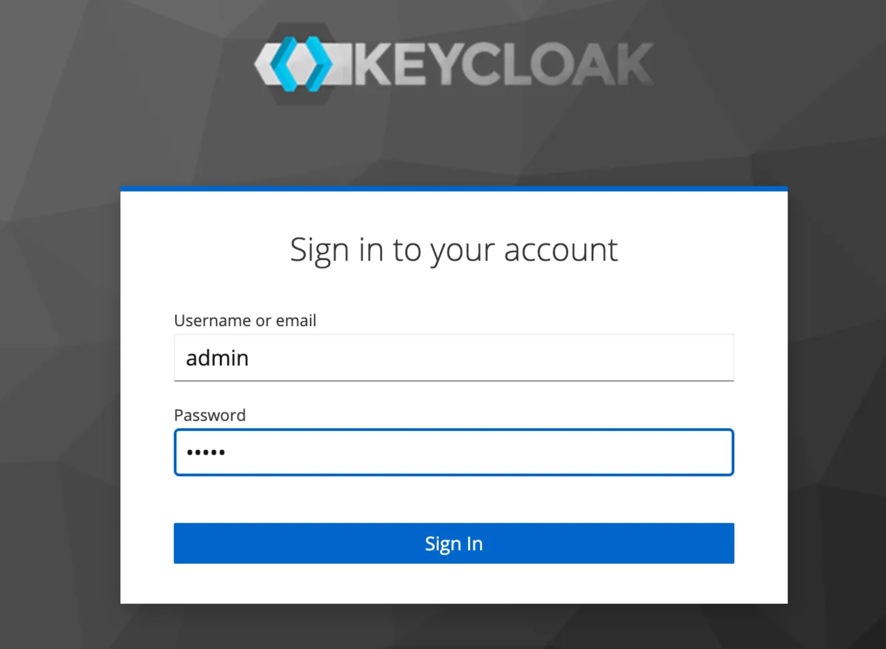
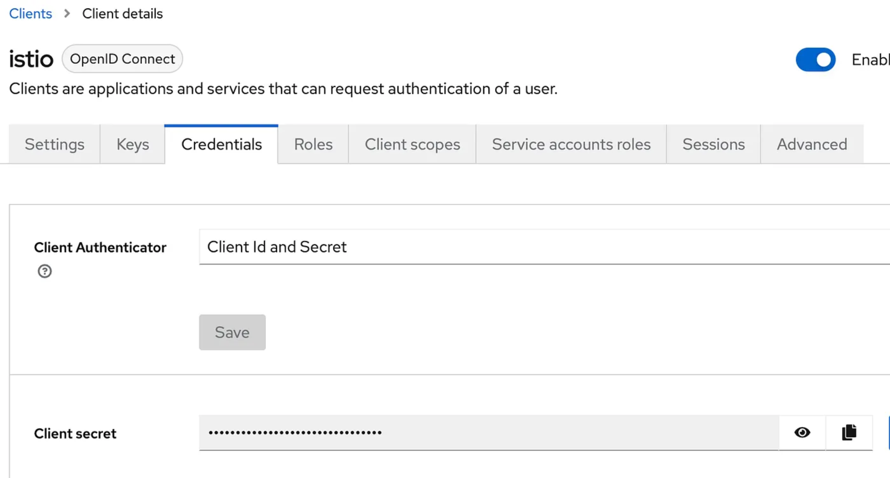
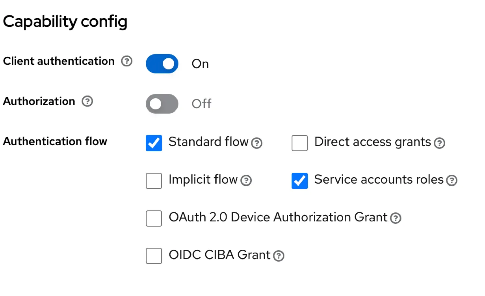
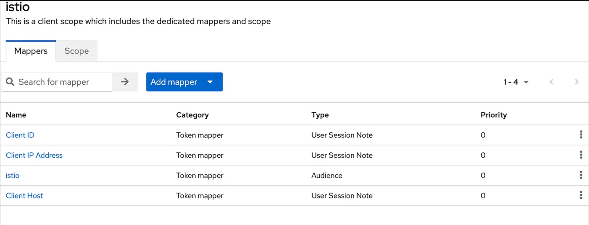
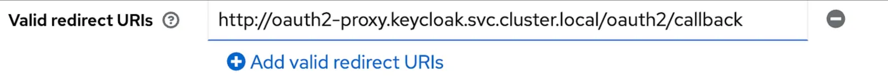
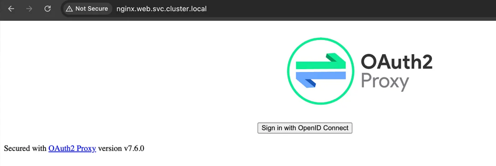
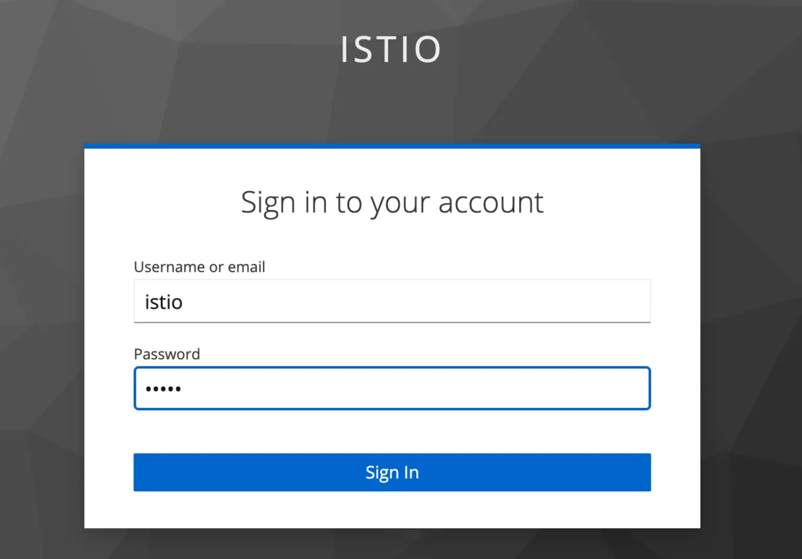
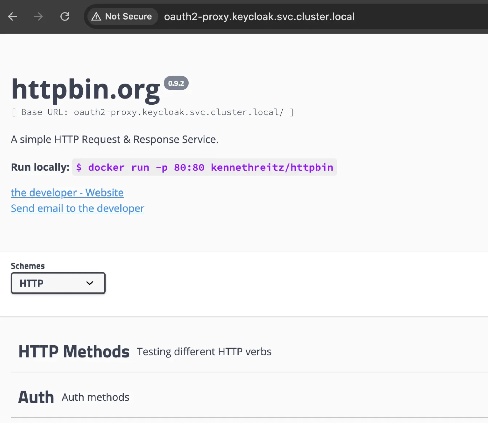
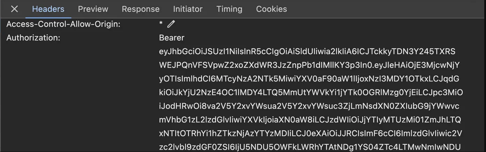
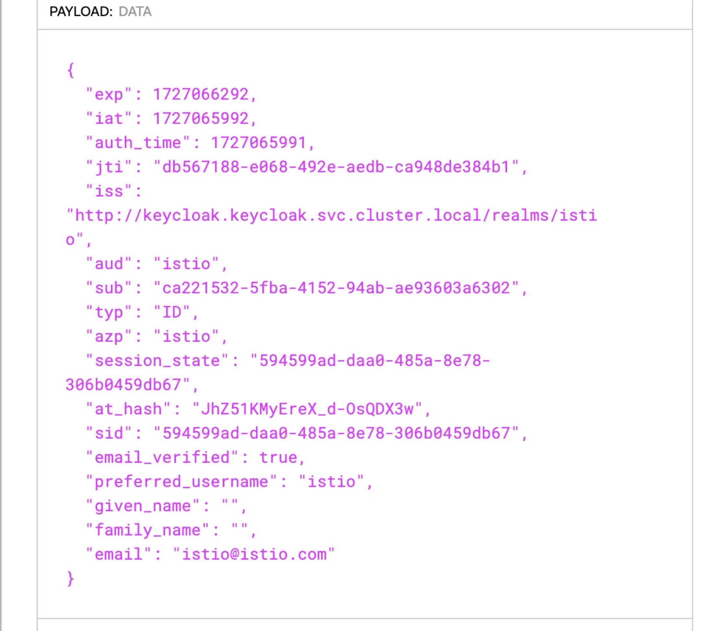

# Keycloak with istio and Oauth2-Proxy

* https://chrishaessig.medium.com/keycloak-with-istio-and-oauth2-proxy-65227a383c15

**What the heck are we trying to do?**
我们到底想干什么?

Setting up Istio with [Keycloak](https://www.keycloak.org/) and [OAuth2 Proxy](https://github.com/oauth2-proxy/oauth2-proxy) is a common pattern for adding authentication and authorization to your microservices architecture. Each component plays a crucial role in securing access to resources while maintaining flexibility and scalability.
将 Istio 与 [Keycloak](https://www.keycloak.org/) 和 [OAuth2 Proxy](https://github.com/oauth2-proxy/oauth2-proxy)集成是为微服务架构添加身份验证和授权的常见模式. 每个组件在确保资源访问安全的同时, 也发挥着至关重要的作用, 并能保持架构的灵活性和可扩展性.

- Keycloak acts as an identity provider (IdP) and OAuth2 authorization server. It manages user authentication, including multi-factor authentication (MFA), single sign-on (SSO), and federation.
  Keycloak 充当身份提供商 (IdP) 和 OAuth2 授权服务器. 它管理用户身份验证, 包括多因素身份验证 (MFA)、单点登录 (SSO) 和联合身份验证.

- By integrating OAuth2 Proxy, you can convert the OAuth2 authentication flow from Keycloak into HTTP headers that are passed to backend services. This decouples services from handling authentication logic, allowing centralized security management.
  通过集成 OAuth2 Proxy, 您可以将 Keycloak 的 OAuth2 身份验证流程转换为传递给后端服务的 HTTP 标头. 这使得服务与处理身份验证逻辑解耦, 从而实现集中式安全管理.

A JWT is a compact, URL-safe token format used for securely transmitting information between two parties. It's commonly used in authentication and authorization systems because of its self-contained nature, allowing for efficient and stateless verification of data.
JWT 是一种紧凑的、URL 安全的令牌格式, 用于在双方之间安全地传输信息. 由于其自包含的特性, JWT 常用于身份验证和授权系统, 能够高效且无状态地验证数据.

JWTs are self-contained, meaning all the information needed to verify the token is included within the token itself. This allows for stateless authentication, where the server doesn't need to store session data. The server simply verifies the token signature and reads the claims.
JWT 是自包含的, 这意味着验证令牌所需的所有信息都包含在令牌本身中. 这实现了无状态身份验证, 服务器无需存储会话数据. 服务器只需验证令牌签名并读取声明即可.

JWTs can include custom claims that allow services to make decisions based on specific user data. For example, roles and permissions can be embedded within the token, enabling role-based access control (RBAC) without requiring additional database lookups.
JWT 可以包含自定义声明, 使服务能够根据特定的用户数据做出决策. 例如, 角色和权限可以嵌入到令牌中, 从而实现基于角色的访问控制 (RBAC), 而无需额外的数据库查询.

Cool beans! Let's set this up to protect a test pod ( httpbin ).
太棒了! 让我们设置一下来保护测试 pod(httpbin).

**Initial istio setup**
初始设置

To start, we setup some namespaces, we create the nginx proxy, and httpbin pod first. We label namespaces that istio will attach too. We also expose the deployments to create a service out of them.
首先, 我们设置一些命名空间, 创建 nginx 代理和 httpbin pod. 我们为 Istio 将要附加到的命名空间添加标签. 我们还公开部署, 以便从中创建一个服务.

```bash
kubectl create ns web
kubectl create ns httpbin
kubectl create ns keycloak

kubectl label ns httpbin istio-injection=enabled
kubectl label ns web istio-injection=enabled

kubectl create deploy httpbin --image=kennethreitz/httpbin -n httpbin
kubectl create deploy web --image=nginx -n web
kubectl expose deploy httpbin --port 80 -n httpbin
kubectl expose deploy web --port 80 -n web
```

**Install Keycloak**
安装 Keycloak

Using helm, lets install keycloak in the keycloak namespace.
让我们使用 Helm 在 Keycloak 命名空间中安装 Keycloak.

```bash
helm repo add bitnami https://charts.bitnami.com/bitnami
helm repo update
helm install keycloak bitnami/keycloak -n keycloak
```

Or you can apply this yaml from the keycloak site.
或者您可以从 Keycloak 网站应用此 YAML 文件.

```bash
kubectl create -f https://raw.githubusercontent.com/keycloak/keycloak-quickstarts/refs/heads/main/kubernetes/keycloak.yaml
```

**Install the oauth-proxy**
安装 oauth-proxy

Then we install the oauth2-proxy also in the keycloak namespace.
然后我们也把 oauth2-proxy 安装在 keycloak 命名空间中.

```bash
helm repo add oauth2-proxy https://oauth2-proxy.github.io/manifests
helm repo update
helm install oauth2-proxy oauth2-proxy/oauth2-proxy -n keycloak
```

Once done everything should be running.
完成后一切应该就能正常运行了.

```bash
kubectl get pods -n keycloak

NAME                            READY   STATUS    RESTARTS   AGE
keycloak-f858787c-cxgtd         1/1     Running   0          6d20h
nginx-proxy-8678f56795-vgr4k    1/1     Running   0          21h
oauth2-proxy-7bf7d55fcd-zr54x   1/1     Running   0          19h
```

**Configure Keycloak**
配置 Keycloak

Now that keycloak is installed, we will need to configure it to handle our requests. We port-forward to the keycloak admin UI. ( username "admin" and password "admin ) to make some changes.
Keycloak 安装完成后, 我们需要配置它来处理我们的请求. 我们将端口转发到 Keycloak 管理界面(用户名"admin", 密码"admin"), 以便进行一些更改.

```bash
kubectl port-forward svc/keycloak 8080:80 -n keycloak
```



Once logged in, click on the `realms` section to create a new realm. I will call mine "istio. Click on `users` and add a user with a email and set a password.
登录后, 点击"领域"部分创建一个新领域. 我将其命名为"istio". 点击"用户", 添加一个用户, 输入邮箱地址并设置密码.

Create a new `client`, I called mine "istio", make sure to copy the client secret as it's needed in a bit.
创建一个新的客户端, 我把它命名为"istio", 请务必复制客户端密钥, 稍后会用到.



Some of these settings are up to you, but I use Client authentication which makes the most sense for my setup.
有些设置由您自行决定, 但我使用客户端身份验证, 这对于我的设置来说是最合理的.



Click `client scope`, click on the <your name>-dedicated assigned client scope. then click "Add Mapper" and "By Configuration" and select Audience.
点击客户端范围, 点击 <your name>-专用的指定客户端范围. 然后单击"添加映射器"和"按配置", 然后选择受众.

It should look like this.
它应该看起来像这样.



We will use the audience later to map our request.
稍后我们将利用受众群体来规划我们的需求.

We also need to tell the client where to go once we authenticated. This will be the location of the oauth2-proxy.
我们还需要告诉客户端身份验证后应该去哪里. 这将是 oauth2-proxy 的位置.



Save it, now keycloak should be all set.
保存一下, 现在 keycloak 应该就准备就绪了.

We deployed oauth2-proxy with helm already but need to reconfigure it to interact with our newly configured keycloak. Replace the cliet-id, client-secret and relevant urls to make sure it matches up with our keycloak install. Upstream for example is where forward too, once the we receive our token.
我们已经使用 Helm 部署了 oauth2-proxy, 但需要重新配置它以与我们新配置的 Keycloak 进行交互. 请替换 client-id、client-secret 和相关 URL, 以确保它与我们的 Keycloak 安装匹配. 例如, 一旦我们收到令牌, 就会转发到上游.

```bash
kubectl edit deploy oauth2-proxy -n keycloak
```

```yaml
containers:
  - args:
  - --http-address=0.0.0.0:4180
  - --https-address=0.0.0.0:4443
  - --provider=oidc
  - --client-id=istio
  - --cookie-secure=false
  - --client-secret=<changetosecret>
  - --oidc-issuer-url=http://keycloak.keycloak.svc.cluster.local/realms/istio
  - --redirect-url=http://oauth2-proxy.keycloak.svc.cluster.local/oauth2/callback
  - --insecure-oidc-allow-unverified-email=true
  - --email-domain=*
  - --cookie-domain=".svc.cluster.local"
  - --cookie-secret=d1h0XXNabU1Wa3lkOZZ5MzwwNVhtSFgzNzBxdW5CU0o=
  - --upstream=http://httpbin.httpbin.svc.cluster.local
  - --whitelist-domain=".svc.cluster.local"
  - --pass-authorization-header=true
  - --set-authorization-header=true
  - --reverse-proxy=true

```

You might be wondering how the OIDC proxy cookie actually work — I know I was at first.
您可能想知道 OIDC 代理 cookie 究竟是如何工作的 — 我知道我一开始也是这样.

When you authenticate with Keycloak and are redirected back to the OIDC proxy, the proxy creates a session cookie. This cookie is encrypted and / or signed using the `cookie-secret` (typically HMAC). This cookie contains the id and access token.
当您使用 Keycloak 进行身份验证并被重定向回 OIDC 代理时, 代理会创建一个会话 cookie. 此 cookie 使用 `cookie-secret` (通常为 HMAC)进行加密和/或签名. 此 cookie 包含 ID 和访问令牌.

On subsequent requests, your browser sends this cookie back to the proxy. The proxy then verifies and decrypts the cookie, extracts the id_token, and uses it to identify the authenticated user. This means it doesn't need to contact Keycloak again for every request.
在后续请求中, 您的浏览器会将此 cookie 发送回代理服务器. 代理服务器随后会验证并解密该 cookie, 提取 id_token, 并使用它来识别已认证的用户. 这意味着它无需为每个请求都再次联系 Keycloak.

The access key is passed via the Authorization: Bearer header. This would be used by istio to extract claims for example.
access key 通过 Authorization: Bearer 标头传递. 例如, Istio 会使用此标头提取声明.

**Protect our httpbin pod**
保护我们的 httpbin pod

We don't want anyone to be able to access our httpbin pod without authentication and authorization, so we apply a RequestAuthentication and AuthorizationPolicy kubernetes CRD.
我们不希望任何人未经身份验证和授权就能访问我们的 httpbin pod, 因此我们应用了 RequestAuthentication 和 AuthorizationPolicy kubernetes CRD.

JWTs can be either a access token or id token. Think of id tokens like your drivers license. Example, if you were at a night club, at the door, you show your ID to prove who you are ( id token ). Then you get a wristband that lets you access the VIP section ( access token ).
JWT 可以是 access token, 也可以是 id token. 你可以把 id token 想象成你的驾照. 例如, 如果你去夜店, 在门口你需要出示身份证件来证明你的身份(id token). 然后你会拿到一个腕带, 凭此腕带可以进入 VIP 区域(access token).

With the RequestAuthentication, we verify that keycloak signed our payload, usually by jwksUri and issuer.
通过 RequestAuthentication, 我们可以验证 Keycloak 是否已对我们的有效负载进行签名, 通常是通过 jwksUri 和 issuer.

Once the token is verified, we use the AuthorizationPolicy to parse the token claims. Below we confirm the audience is istio.
令牌验证完成后, 我们使用 AuthorizationPolicy 来解析令牌声明. 下面我们确认受众是 istio.

```yaml
apiVersion: security.istio.io/v1beta1
kind: RequestAuthentication
metadata:
  name: jwt-confirm
  namespace: httpbin
spec:
  selector:
    matchLabels:
      app: httpbin
  jwtRules:
    - issuer: "http://keycloak.keycloak.svc.cluster.local/realms/istio"
      jwksUri: "http://keycloak.keycloak.svc.cluster.local/realms/istio/protocol/openid-connect/certs"
      audiences:
        - "istio"
---
apiVersion: security.istio.io/v1beta1
kind: AuthorizationPolicy
metadata:
  name: verify-jwt
  namespace: httpbin
spec:
  selector:
    matchLabels:
      app: httpbin
  action: ALLOW
  rules:
    - from:
        - source:
            requestPrincipals:
              ["http://keycloak.keycloak.svc.cluster.local/realms/istio/*"]
      when:
        - key: request.auth.claims[aud]
          values: ["istio"]

```

**Configure Istio and Ingress**

Keep in mind I am using a k8s cluster with kind. But I need to be able to resolve nginx, keycloak, and oauth hostnames and point them to the correct destination. Of course feel free to use your own.
请注意, 我使用的是带有 kind 的 Kubernetes 集群. 但我需要能够解析 nginx、keycloak 和 oauth 的主机名, 并将它们指向正确的目标. 当然, 您也可以使用您自己的配置.

I made this happen by setting up my /etc/hosts file.
我通过设置 /etc/hosts 文件实现了这一点.

```
127.0.0.1 nginx.web.svc.cluster.local
127.0.0.1 oauth2-proxy.keycloak.svc.cluster.local
127.0.0.1 keycloak.keycloak.svc.cluster.local
```

My gateway routes are defined below, your wills greatly differ. Listening on port 3333, depending on the hostname, will route to the appropriate locations.
我的网关路由定义如下, 您的具体配置可能有所不同. 监听 3333 端口, 根据主机名将流量路由到相应的位置.

```yaml
apiVersion: networking.istio.io/v1beta1
kind: Gateway
metadata:
  name: nginx
  namespace: istio-gateways
spec:
  selector:
    istio: ingressgateway
  servers:
    - port:
        number: 3333
        name: http
        protocol: HTTP
      hosts:
        - nginx.web.svc.cluster.local
        - keycloak.keycloak.svc.cluster.local
        - oauth2-proxy.keycloak.svc.cluster.local
---
apiVersion: networking.istio.io/v1beta1
kind: VirtualService
metadata:
  name: oauth2-proxy
  namespace: istio-gateways
spec:
  gateways:
    - nginx
  hosts:
    - "nginx.web.svc.cluster.local"
  http:
    - match:
        - uri:
            prefix: "/"
      route:
        - destination:
            host: nginx.web.svc.cluster.local
            port:
              number: 80
---
apiVersion: networking.istio.io/v1beta1
kind: VirtualService
metadata:
  name: oauth2-proxy-keycloak
  namespace: istio-gateways
spec:
  gateways:
    - nginx
  hosts:
    - "keycloak.keycloak.svc.cluster.local"
  http:
    - match:
        - uri:
            prefix: "/"
      route:
        - destination:
            host: keycloak.keycloak.svc.cluster.local
            port:
              number: 80
---
apiVersion: networking.istio.io/v1beta1
kind: VirtualService
metadata:
  name: oauth2-proxy-proxy
  namespace: istio-gateways
spec:
  gateways:
    - nginx
  hosts:
    - "oauth2-proxy.keycloak.svc.cluster.local"
  http:
    - match:
        - uri:
            prefix: "/"
      route:
        - destination:
            host: oauth2-proxy.keycloak.svc.cluster.local
            port:
              number: 80

```

Now that the ingress should be working, we also need to apply an EnvoyFilter to our nginx pod. We want traffic to redirect to keycloak via the oauth2-proxy if a token is invalid or does not exist. Configuring Istio with a EnvoyFilter will achieve our goal by doing the redirection, we tie this logic to the pod with the app=nginx label.
现在 Ingress 应该可以正常工作了, 我们还需要给 Nginx Pod 添加一个 EnvoyFilter. 我们希望在令牌无效或不存在时, 流量通过 oauth2-proxy 重定向到 Keycloak. 通过配置 Istio 并添加 EnvoyFilter 来实现重定向, 我们将此逻辑绑定到带有 app=nginx 标签的 Pod 上.

```yaml
apiVersion: networking.istio.io/v1alpha3
kind: EnvoyFilter
metadata:
  name: oauth2-proxy-filter
  namespace: web
spec:
  workloadSelector:
    labels:
      app: nginx
  configPatches:
    - applyTo: HTTP_FILTER
      match:
        context: SIDECAR_INBOUND
        listener:
          filterChain:
            filter:
              name: "envoy.filters.network.http_connection_manager"
              subFilter:
                name: "envoy.filters.http.router"
      patch:
        operation: INSERT_BEFORE
        value:
          name: envoy.filters.http.ext_authz
          typed_config:
            "@type": type.googleapis.com/envoy.extensions.filters.http.ext_authz.v3.ExtAuthz
            http_service:
              server_uri:
                uri: http://oauth2-proxy.keycloak.svc.cluster.local:80
                cluster: outbound|80||oauth2-proxy.keycloak.svc.cluster.local
                timeout: 5s
              authorization_request:
                allowed_headers:
                  patterns:
                    - exact: "cookie"
                    - exact: "authorization"
              authorization_response:
                allowed_upstream_headers:
                  patterns:
                    - exact: "set-cookie"
                    - exact: "authorization"

```

Using an EnvoyFilter to apply the auth logic to the nginx pod is explained above, this made the most sense on my environment. You can also apply the external authorizer to the istio config globally and NOT use a EnvoyFiler.
上文解释了如何使用 EnvoyFilter 将身份验证逻辑应用于 nginx pod, 这在我的环境中是最合理的选择. 您也可以将外部授权器全局应用于 Istio 配置, 而无需使用 EnvoyFilter.

Example below.
以下是一个示例.

```yaml
meshConfig:
  extensionProviders:
    - name: "oauth2-authz"
      envoyExtAuthzHttp:
        service: "oauth2-proxy.keycloak.svc.cluster.local"
        port: 80
        includeHeadersInCheck:
          - "authorization"
          - "cookie"
          - "x-forwarded-for"
          - "x-request-id"
        includeHeadersInResponse:
          - "authorization"
          - "set-cookie"
          - "x-auth-user"
        timeout: "5s"
  defaultProviders:
    authorization: "oauth2-authz"

```

**Trying it out**
试用一下

We should be set! The first thing we should do is try and hit httpbin. Remember, our RequestAuthentication and AuthorizationPolicy CRDs will prevent us from accessing the pod as we are not sending a valid token and even if we did, the audience claim "istio" is not set.
一切就绪! 首先, 我们应该尝试访问 httpbin. 请记住, 由于我们没有发送有效的令牌, 我们的 RequestAuthentication 和 AuthorizationPolicy CRD 会阻止我们访问 pod; 即使我们发送了令牌, 受众声明"istio"也未设置.

```bash
curl httpbin.httpbin
RBAC: access denied
```

Perfect, this is what we want to see. How about if we open a browser and go to nginx.web.svc.cluster.local, looks like it redirects us to the oauth2-proxy then keycloak.
太好了, 这正是我们想要看到的. 如果我们打开浏览器访问 nginx.web.svc.cluster.local, 看起来它会将我们重定向到 oauth2-proxy, 然后再重定向到 keycloak.



Then we login
然后我们登录



And it redirects us to httpbin, without the "RBAC denied" message, sweet, it worked.
它把我们重定向到 httpbin, 没有出现"RBAC 被拒绝"的消息, 太好了, 成功了.



A quick walk through, we hit nginx.web.svc.cluster.local which redirects us to the oauth2-proxy via a EnvoyFilter. That redirected us to keycloak. We login to keycloak which then redirected us back to the oauth2-proxy which redirected us to the httpbin pod passing the Bearer token.
简单来说, 我们访问 nginx.web.svc.cluster.local, 它会通过 EnvoyFilter 将我们重定向到 oauth2-proxy. oauth2-proxy 又会将我们重定向到 keycloak. 我们登录 keycloak, 然后它又会将我们重定向回 oauth2-proxy, 最后 oauth2-proxy 会将我们重定向到 httpbin pod, 并传递 Bearer 令牌.

If you look at the network traffic, we can find the token returned.
查看网络流量, 我们可以找到返回的令牌.



The istio CRDs then parsed the token pulling out the respected claims, if you take the token and paste it into http://jwt.io we can see that it contains.
然后 istio CRD 解析令牌, 提取相应的声明. 如果您将令牌粘贴到 http://jwt.io 中, 我们可以看到它包含以下内容.



It is NOT a coincidence that the data in the token has data we populated with keycloak. Notice, our audience claim is referenced with the AuthorizationPolicy CRD as well.
令牌中的数据包含我们使用 Keycloak 填充的数据, 这并非巧合. 请注意, 我们的受众声明也引用了 AuthorizationPolicy CRD.

**Summary**

Don't be fooled, this stuff is complicated and we have only began to explore what is possible, but I hope this helps with your system.
别被误导了, 这东西很复杂, 我们才刚刚开始探索各种可能性, 但我希望这对你的系统有所帮助.
